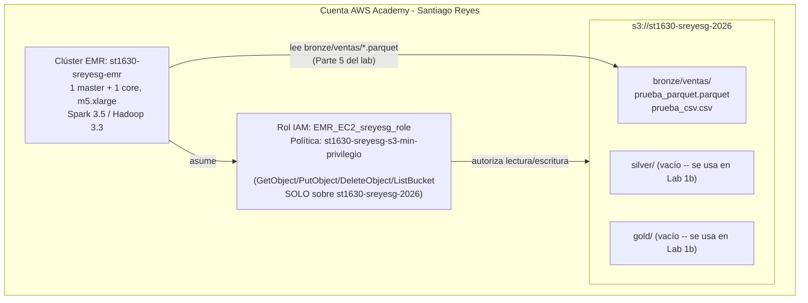

# Arquitectura — Lab 1a (ejemplo de referencia)

**Curso:** ST1630-2026-2 · **Semana:** S4-S5 · **Fecha de entrega:** 2026-08-20
**Estudiante:** Santiago Reyes (santiago.reyes@eafit.edu.co) — **estudiante ficticio, ejemplo de referencia**

> Este documento **no es una plantilla para copiar y pegar**. Compara
> tus respuestas contra este ejemplo en profundidad y forma de
> argumentar, no en contenido — tu bucket, tus permisos y tus números
> de costo deben salir de tu propia ejecución.

## 1. Diagrama de la arquitectura

## 2. Decisiones de S3

| Decisión | Tu elección | Justificación |
|---|---|---|
| Nombre del bucket | `st1630-sreyesg-2026` | Sigue la convención del lab (`st1630-{usuario}-{año}`); usar mi usuario institucional en vez de mi nombre completo evita colisiones de unicidad global sin exponer más información personal de la necesaria |
| Región | `us-east-1` | Es la región donde AWS Academy aprovisiona por defecto los créditos del curso, y la de menor costo por hora tanto para S3 como para EC2/EMR |
| Estructura de prefijos | `bronze/`, `silver/`, `gold/` en la raíz del bucket, y dentro de cada capa un prefijo por dominio de datos (`bronze/ventas/`) | Refleja exactamente la arquitectura medallion vista en clase (S4): cada capa es un prefijo de primer nivel, no una convención de nombre de archivo, para que las políticas IAM y los jobs de Spark puedan apuntar a una capa completa con un solo patrón de ruta (`bronze/*`) |

**Justificación del particionamiento** (3-5 líneas): Para este lab
dejé `bronze/ventas/` sin particionar por fecha porque el volumen es de
apenas 10.000 filas en dos archivos -- particionar un dataset tan
pequeño solo añadiría prefijos vacíos sin beneficio de poda de
partición real. Si este datalake creciera con cargas diarias reales
(como se verá en el Lab 1b), sí particionaría `silver/ventas/` por
`fecha=YYYY-MM-DD/` para que Spark pueda hacer *partition pruning* y
leer solo los días relevantes de una consulta, en vez de escanear todo
el histórico.

## 3. Decisiones de IAM

- ¿Qué permisos otorgaste al rol de EMR, exactamente?

  Una única política administrada por mí (`st1630-sreyesg-s3-min-privilegio`)
  con dos statements: (1) `s3:GetObject`, `s3:PutObject` y
  `s3:DeleteObject` sobre `arn:aws:s3:::st1630-sreyesg-2026/*` (los
  objetos dentro del bucket), y (2) `s3:ListBucket` sobre
  `arn:aws:s3:::st1630-sreyesg-2026` (el bucket como recurso, sin el
  sufijo `/*`, porque listar es una operación sobre el bucket, no sobre
  un objeto específico dentro de él).

- ¿Qué permisos consideraste y descartaste? ¿Por qué?

  Consideré agregar `s3:PutBucketPolicy` y `s3:PutBucketAcl` para que
  el clúster pudiera, en teoría, ajustar sus propios permisos de bucket
  si algo fallaba durante la ejecución. Los descarté: el clúster EMR
  nunca necesita cambiar permisos del bucket para leer o escribir
  objetos, y darle esa capacidad convertiría un compromiso del clúster
  (por ejemplo, un bootstrap action malicioso) en un compromiso también
  de los controles de acceso del bucket -- exactamente el tipo de
  escalamiento de privilegio que el mínimo privilegio busca cortar de
  raíz.

- ¿Por qué importa el mínimo privilegio específicamente en un sistema
  **distribuido** como este?

  En un sistema distribuido, el rol IAM no lo usa una sola persona
  desde un solo punto: lo asumen automáticamente todas las instancias
  EC2 del clúster (master y cada core/task node), y ese número de
  instancias puede crecer con autoescalado sin que yo intervenga
  directamente en cada una. Eso multiplica la superficie de ataque: si
  el rol tuviera `Resource: "*"`, cada nodo adicional del clúster sería
  un punto adicional desde el cual, ante un bug o una librería de
  Python comprometida instalada en el bootstrap, se podría leer o
  borrar objetos en *cualquier* bucket de la cuenta -- no solo el mío.
  Hay un paralelo directo con el Teorema CAP: así como un nodo AP que
  retorna un dato viejo rompe la garantía de consistencia que el resto
  del sistema asume, un rol con permisos excesivos rompe la garantía de
  aislamiento que el resto de la cuenta (otros buckets, otros
  estudiantes en la misma organización de AWS Academy) asume que existe
  entre recursos. En ambos casos, el "resto del sistema" confía en una
  frontera que, si no se aplica explícitamente, no existe.

## 4. Decisiones de EMR

- Tipo de instancia elegido y justificación:

  `m5.xlarge` (4 vCPU, 16 GiB RAM) para master y core, que es la
  configuración mínima viable indicada en el lab. La elegí porque es
  suficiente para correr Spark en modo verdaderamente distribuido (1
  driver + al menos 1 executor en un nodo separado) sin sobrepasar el
  presupuesto de créditos de AWS Academy. Para producción no usaría
  esta configuración: un solo core node no tiene tolerancia a fallos
  real (si ese nodo se cae, el clúster se queda sin capacidad de
  cómputo), y elegiría al menos 2-3 core nodes con auto scaling, además
  de considerar instancias spot para los task nodes para reducir costo.

- Configuración de Spark/aplicaciones instaladas:

  `emr-6.15.0` con las aplicaciones `Spark` y `Hadoop` (HDFS no se usa
  como almacenamiento principal -- todo el dato vive en S3 -- pero
  Hadoop se mantiene porque EMR lo requiere para YARN, el gestor de
  recursos que Spark usa por debajo). Agregué el bootstrap action que
  instala `pandas` y `pyarrow` en cada nodo, aunque el notebook de
  verificación solo usa PySpark nativo -- lo dejé como base reutilizable
  para el Lab 1b, donde sí voy a necesitar esas librerías para
  transformar datos entre capas.

## 5. Estimación de costo

| Escenario | Costo estimado |
|---|---|
| Clúster encendido 24/7 durante un mes | ~USD 390/mes (2 nodos m5.xlarge × ~USD 0.192/h EC2 + ~USD 0.096/h de cargo EMR por nodo × 720 h, tarifas aproximadas de us-east-1 verificadas en calculator.aws el 2026-08-15) |
| Clúster encendido solo durante las ~3 horas que lo usé para el lab | ~USD 1.70 (mismo cálculo × 3 h) |

La diferencia entre ambos escenarios (~230x) es la razón concreta por
la que el lab insiste tanto en el comando de apagado: dejar el clúster
encendido "por si acaso" durante una semana agotaría solo por cómputo
más de la mitad de mis créditos de AWS Academy del semestre completo.

## 6. Reflexión — la era agéntica

La decisión en la que más dudé fue si dejar `s3:ListBucket` en el
mismo statement que `GetObject`/`PutObject`/`DeleteObject` o separarlo.
Le pregunté a un agente de IA cuál era la diferencia entre dar
`ListBucket` a nivel de bucket vs. a nivel de objeto, porque no me
quedaba claro por qué IAM distingue esos dos ARNs para la misma
"carpeta" lógica -- el agente me explicó correctamente que `ListBucket`
es una operación sobre el recurso bucket (equivalente a listar su
contenido), mientras que `GetObject`/`PutObject` actúan sobre el
recurso objeto (`bucket/key`), y que por eso IAM exige ARNs distintos
(`bucket` vs. `bucket/*`) aunque conceptualmente uno piense en ambos
como "acceso a mi carpeta". Entender esa distinción fue lo que delegué;
la decisión de mantener ambos permisos en la misma política (en vez de
separarlos en dos políticas) la tomé yo, porque ambos son necesarios
para el mismo caso de uso (Spark necesita listar el prefijo antes de
poder leer los objetos que contiene) y separarlos no aportaba ningún
control adicional real.

## 7. Bitácora de delegación

| Tarea | ¿Delegado a agente? | Justificación |
|---|---|---|
| Boilerplate de los tres scripts bash (`setup_s3.sh`, `setup_iam.sh`, `create_emr.sh`) | No — ya venían del repo del curso | Los scripts base los provee el lab; yo solo edité las variables `ESTUDIANTE`, `REGION`, `KEY_NAME` y `SUBNET_ID` según mi cuenta |
| Entender la diferencia entre `ListBucket` a nivel de bucket vs. de objeto en IAM | Sí | Duda puntual de sintaxis/semántica de IAM, de bajo valor de aprendizaje memorizar de memoria — permitido por defecto según `docs/politica-ia.md` |
| Decidir qué permisos incluir y cuáles descartar en la política de mínimo privilegio | No | Es la decisión de diseño central de la Parte 3 del lab; debe reflejar mi propio criterio, no el de un agente |
| Troubleshooting de un `AccessDenied` al intentar `create-instance-profile` (mi usuario de Academy no tenía el permiso `iam:TagInstanceProfile` por defecto) | Sí | Troubleshooting repetitivo de configuración de entorno, no una decisión de arquitectura |
| Redacción final de este `architecture.md` (ortografía y formato de las tablas) | Parcial | Escribí el contenido y los argumentos yo mismo; usé el agente solo para revisar redacción y alinear el formato Markdown de las tablas |

> Los permisos IAM, la estructura de prefijos y la interpretación de
> los resultados de Spark en este documento reflejan mi propio criterio
> (ver `../../../docs/politica-ia.md`).
